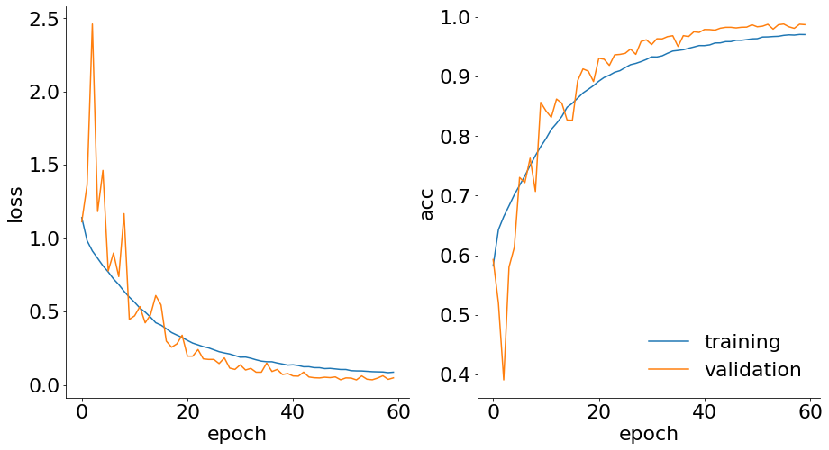
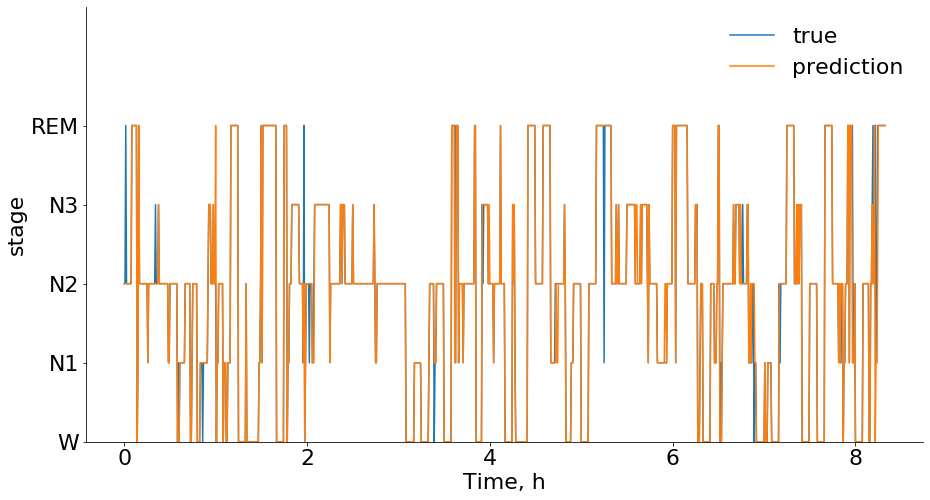

# Automatic_Sleep_Scoring

The goal is to create an automatic (preferably online) sleep stage scoring of raw EEG signals.

## Setup

EEG signals are from https://www.physionet.org/content/sleep-edfx/1.0.0/

[Download zip file](https://www.physionet.org/static/published-projects/sleep-edfx/sleep-edf-database-expanded-1.0.0.zip) and unzip into `$HOME/eeg`.

```bash
pip install -r requirements.txt

python code/EDF_load_process.py --home $HOME
```

## Data description

Files are named in the form SC4ssNEO-PSG.edf where ss is the subject number, and N is the night. The first nights of subjects 36 and 52, and the second night of subject 13, were lost due to a failing cassette or laserdisk.

The EOG and EEG signals were each sampled at 100 Hz. The submental-EMG signal was electronically highpass filtered, rectified and low-pass filtered after which the resulting EMG envelope expressed in uV rms (root-mean-square) was sampled at 1Hz. Oro-nasal airflow, rectal body temperature and the event marker were also sampled at 1Hz.

The *Hypnogram.edf files contain annotations of the sleep patterns that correspond to the PSGs. These patterns (hypnograms) consist of sleep stages W, R, 1, 2, 3, 4, M (Movement time) and ? (not scored). All hypnograms were manually scored by well-trained technicians (identified by the eighth letter of the hypnogram filename) according to the 1968 Rechtschaffen and Kales manual [3], but based on Fpz-Cz/Pz-Oz EEGs instead of C4-A1/C3-A2 EEGs, as suggested by [4]).

The PSG files are formatted in EDF while the hypnograms are in EDF+. The specifications of EDF and EDF+ are on www.edfplus.info and in [5,6]. Each EDF and EDF+ file has a header specifying the patient (in these files anonymized to only gender and age), details of the recording (in particular the recorded time period), and characteristics of the signals including their amplitude calibration.

## Model

I used a two stream CNN with different filter sizes on two EEG and one ECoG channels (to capture low and high frequency features). Each pass through the was than flattened and connected to a fully connected layer. These features where than used as a single time step for a LSTM network. Over all we used sequence lengths of 10.

## Training and Testing

I Trained the data on 9/10 of the data, using data from all but two pacients. Training ran for 70 epochs on AWS cloud instance using a GPU. Below you can see that trainig error and Accuracy graphs.



## Results

Here is an example of the model classification compared to ground truth




